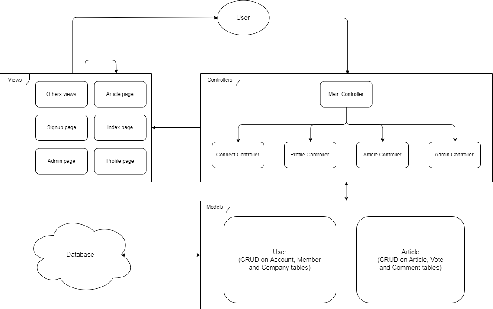

# Architecture

## Diagram


## Description
The architecture is based on the MVC model. Indeed, when the user connects, the hand controller provides the user with the index view. When the user wants to change pages, a "page" parameter appears with the page he wants to access. In the main controller when a page is requested it tests whether this page exists, if it exists then it redirects to another controller, otherwise it provides the view of 404 error. There is also the "action" parameter which allows you to do a particular action such as voting, editing, deleting...<br/>
Some controllers require data recovery, for this we include the connection to the database and the necessary model(s). Once the data has been recovered and processed, the completed page is returned to the user. The same applies to the sending of data.

## Model - Class
```php
class Article { 
    public static function getArticle(string $hash);                                    //Get article by hash
    public static function getAllArticles();                                            //Get all articles
    public static function getLastArticleFromCompany(int $id_company);                  //Get the last article create by a company
    public static function createArticle(array $data);                                  //Create article
    public static function updateArticle(array $data);                                  //Update article
    public static function updateArticleAttachment(array $data);                        //Update path for attachment for an article
    public static function deleteArticle(int $id);                                      //Delete article
    public static function getVotes(int $id_article);                                   //Get all votes on an article
    public static function getVote(array $data);                                        //Get vote for an user and an article
    public static function createVote(array $data);                                     //Create vote for an user and an article
    public static function updateVote(array $data);                                     //Update vote for an user and an article
    public static function deleteVote(array $data);                                     //Delete vote for an user and an article
    public static function getComment(array $data);                                     //Get comment for an article and an admin
    public static function getCommentFromArticle(int $id);                              //Get comment for an article
    public static function createComment(array $data);                                  //Create comment for an article
    public static function updateComment(array $data);                                  //Update comment for an article
    public static function deleteComment(array $data);                                  //Delete comment for an article
    public static function getNbVotes(int $id_article);                                 //Get number of vote for an article
    public static function voteFor(int $id_account, int $id_article, string $value);    //Vote for an article
    public static function getAJAXFunctionsVote(string $id_hash);                       //Get ajax function vor vote
}


class User {
    public static function getAccount(string $mail);            //Get Account by mail
    public static function getAccountByID(int $id);             //Get Account by id_account
    public static function getAdmin();                          //Get Account of the admin
    public static function isAdmin($id);                        //True if the id is the same as the admin's id, else false
    public static function createAccount(array $data);          //Create Account
    public static function updateAccount(array $data);          //Update Account (all fields)
    public static function updateInfoAccount($data);            //Update Account info (last_name, first_name, mail, phone)
    public static function updatePasswordAccount($data);        //Update password Account
    public static function deleteAccount(int $id);              //Delete Accounts
    public static function getMember(string $mail);             //Get Member by mail (join Member and Account)
    public static function getMemberByID(int $id);              //Get Member by id (join Member and Account)
    public static function getAllMembers();                     //Get all Members (join Member and Account)
    public static function isMember($id);                       //True if the id is in Members id, else false
    public static function createMember(array $data);           //Create Member (Account by the way)
    public static function updateMember(array $data);           //Update Member (Account by the way)
    public static function deleteMember(int $id);               //Delete Member (Account by the way)
    public static function getCompany(string $mail);            //Get Company by mail (join Company and Account)
    public static function getCompanyByID(int $id);             //Get Company by id (join Company and Account)
    public static function getAllCompanies();                   //Get all Companies (join Company and Account)
    public static function isCompany($id);                      //True if the id is in Companies id, else false
    public static function getCompanyName(int $id);             //Get the social_reason of a Company
    public static function createCompany(array $data);          //Create Company (Account by the way)
    public static function validCompany(bool $value, int $id);  //Change validation of a Company
    public static function updateCompany(array $data);          //Update Company (Account by the way)
    public static function deleteCompany(int $id);              //Delete Company (Account by the way)
}
```