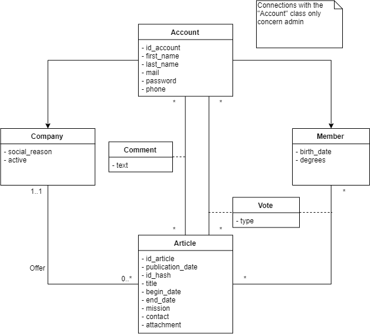

# Database
## Physical Database Model
Account(<u>id_account</u>, first_name, last_name, mail, password, phone)<br/>
Member(<u>#id_member</u>, birth_date, degrees)<br/>
Company(<u>#id_company</u>, social_reason, active)<br/>
Article(<u>id_article</u>, id_company, publication_date, id_hash, title,begin_date, end_date, mission, contact, attachment)<br/>
Comment(<u>#id_admin, #id_article</u>, text)<br/>
Vote(<u>#id_account, #id_article</u>, type)<br/>

## Database Class Diagram


## Script for creating the database schema
```
CREATE SCHEMA InternshipManager;
SET search_path=InternshipManager;

CREATE TABLE account (
    id_account SERIAL NOT NULL,
    first_name VARCHAR(15) NOT NULL,
    last_name VARCHAR(15) NOT NULL,
    mail VARCHAR(80) NOT NULL,
    password VARCHAR(64) NOT NULL,
    phone VARCHAR(15) DEFAULT NULL,

    CONSTRAINT pk_account PRIMARY KEY (id_account),
    CONSTRAINT u_account UNIQUE (mail)
);

CREATE TABLE member (
    id_member INTEGER NOT NULL,
    birth_date Date DEFAULT NULL,
    degrees VARCHAR DEFAULT NULL,
    
    CONSTRAINT pk_member PRIMARY KEY (id_member),
    CONSTRAINT fk_member FOREIGN KEY (id_member) REFERENCES account (id_account) ON DELETE CASCADE ON UPDATE CASCADE
);

CREATE TABLE company (
    id_company INTEGER NOT NULL,
    social_reason VARCHAR(40) NOT NULL,
    active BOOLEAN DEFAULT FALSE NOT NULL,

    CONSTRAINT pk_company PRIMARY KEY (id_company),
    CONSTRAINT fk_company FOREIGN KEY (id_company) REFERENCES account (id_account) ON DELETE CASCADE ON UPDATE CASCADE
);

CREATE TABLE article (
    id_article SERIAL NOT NULL,
    id_company INTEGER NOT NULL,
    publication_date TIMESTAMP NOT NULL DEFAULT current_timestamp,
    id_hash VARCHAR(32) NOT NULL,
    title VARCHAR(30) NOT NULL,
    begin_date Date NOT NULL,
    end_date Date NOT NULL,
    mission VARCHAR NOT NULL,
    contact VARCHAR NOT NULL,
    attachment VARCHAR DEFAULT NULL,

    CONSTRAINT pk_article PRIMARY KEY (id_article),
    CONSTRAINT fk_article FOREIGN KEY (id_company) REFERENCES company (id_company) ON DELETE CASCADE ON UPDATE CASCADE,
    CONSTRAINT u_article UNIQUE (id_hash)
);

CREATE TABLE comment (
    id_admin INTEGER NOT NULL,
    id_article INTEGER NOT NULL,
    text VARCHAR NOT NULL,

    CONSTRAINT pk_comment PRIMARY KEY (id_admin, id_article),
    CONSTRAINT fk_comment_admin FOREIGN KEY (id_admin) REFERENCES account (id_account),
    CONSTRAINT fk_comment_article FOREIGN KEY (id_article) REFERENCES article (id_article) ON DELETE CASCADE ON UPDATE CASCADE
);

CREATE TABLE vote (
    id_account INTEGER NOT NULL,
    id_article INTEGER NOT NULL,
    type BOOLEAN NOT NULL,

    CONSTRAINT pk_vote PRIMARY KEY (id_account, id_article),
    CONSTRAINT fk_vote_admin FOREIGN KEY (id_account) REFERENCES account (id_account) ON DELETE CASCADE ON UPDATE CASCADE,
    CONSTRAINT fk_vote_article FOREIGN KEY (id_article) REFERENCES article (id_article) ON DELETE CASCADE ON UPDATE CASCADE
);
```